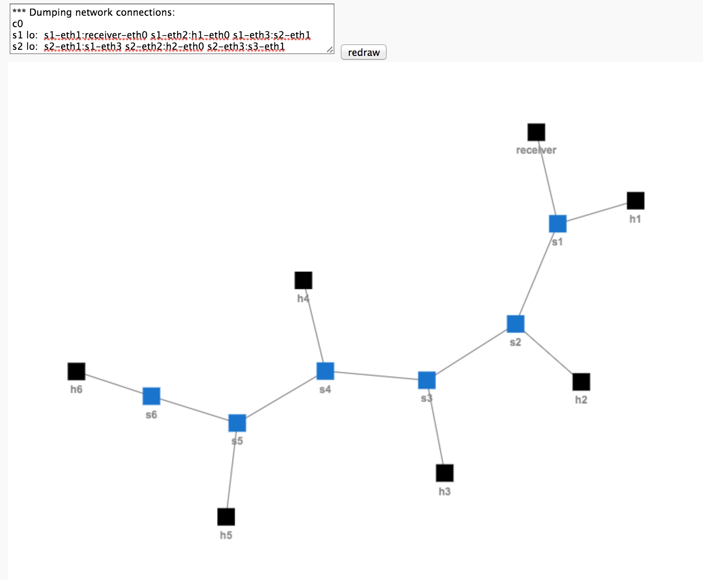

# Visualiser for mininet's dumpNodeConnections.

Warning: This is a quick hack. I'm not a front end developer. Built using arbor.js.

[Link to live Demo](https://achille.github.io/mininet-dump-visualizer/)

Screenshot:

